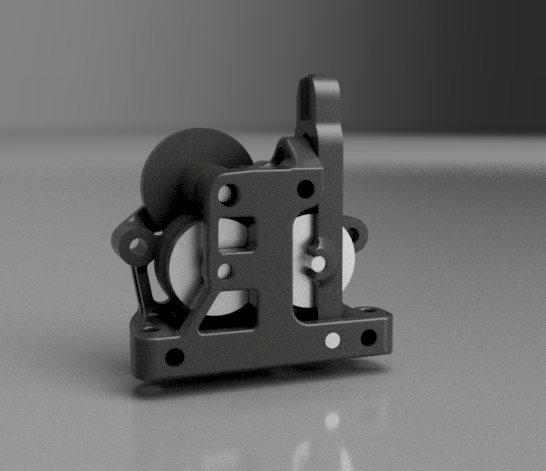

# Kami Mini extruder

# A extruder using Bondtech™ LGX gears

Heavily inspired by the [Sherpa Mini](https://github.com/Annex-Engineering/Sherpa_Mini-Extruder) by [Annex Engineering](https://github.com/Annex-Engineering/)

Same attachment spacing and filament path as the Sherpa Mini therefore you can reuse your current tool mount along with PTFE tubes.

## Bill of Materials (BOM)

### Common hardware
- 4x M3x5x4mm heat inserts
- 2x M3x12mm ISO 7380 button head screws
- 3x M3x25mm ISO 7380 button head screws
- Bondtech BMG Thumbscrew Tensioner
- Latch Arm axis:
   - 3x20mm dowel pin

   or

   - 1x M3x5x4mm heat inserts
   - 1x M3x25mm ISO 7380 button head screw

### Bondtech™ LGX parts
Either scavenge the LGX or LGX lite for parts or:
- 1x [LGX® Primary Gear](https://www.bondtech.se/product/lgx-primary-gear/)
- 2x [LGX® Secondary Gear](https://www.bondtech.se/product/lgx-secondary-gear/)
- 2x [LGX® Hardened Steel Drive Wheel](https://www.bondtech.se/product/lgx-hardened-steel-drive-wheel/)
- 2x [Needlebearing](https://www.bondtech.se/product/needlebearing/)
- 2x 3x16mm dowel pins
- 1x 3x20mm dowel pin

1x Nema 14 36mm Pancake Stepper - 10T (T=Teeth) or 8T it's up to you, good choices are high temp models:
 - MOONS' CSE14HRA1L410A
 - LDO-36STH17-1004AHG

## Assembly
See the [assembly.md](assembly.md).

## Potential gotchas
The 4 (+one optional for arm latch axis using screw instead of pin) M3x5x4 heat inserts are used. Can be brought in any decent 3d printing eshop selling parts for Voron.

Latch Arm combined with Thumbscrew Tensioner should provide enough of grip on filament. However the latch frame is quite thin (design issue) and could [break](imgs/BrokenLatchArm.jpg). Solution for that is to print it with filament enriched with CF (I am using Prusament PC CF with great success) or aneal it after printing to further improve layer bonding. Or try to print it rotated by 90° (requires supports) so the layers go perpendicular against tension force.

## Print Settings
Use ABS or ASA if posssible. It depends on whever you will be using the Extruder. PLA or PETG is not suitable for enclosed cashber usage. Or even better use PC CF (see info  above).
The STL's are already oriented for you, so you only need to send them to the slicer.
There is no need for supports; recommended settings are 4 perimeters/top/bottom, at least 30% infill. You might consider rotating 90° the Latch Arm due to issue mentioned above.